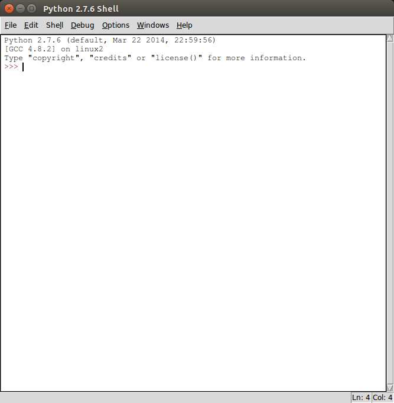
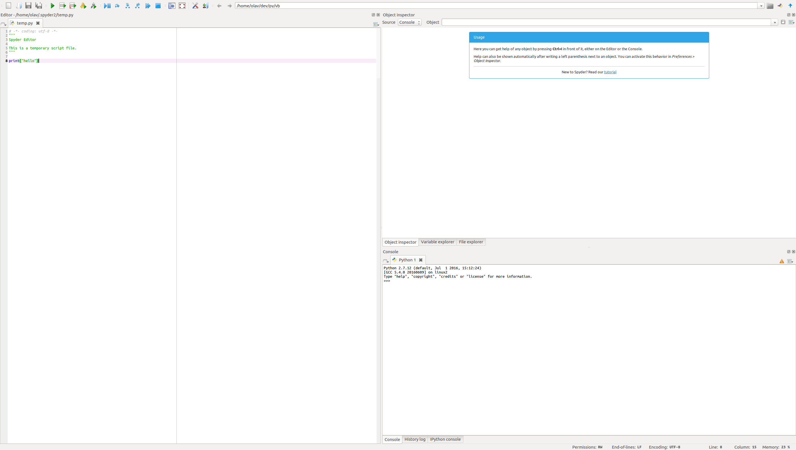

# Computational Python

## Olav Vahtras

KTH

---

layout: false


## Scripting overview

### Scripts

* Programs in a flexible high-level language
* Interpreted 
* Not compiled (as C, C++, Fortran)
* Examples: python, perl, sed, awk, bash, ruby, tcl

---

## Bash

* Bourne-again shell: http://www.gnu.org/software/bash
* Some combinations of commands are used often
* Collect command-line commands in a file
* Execute file

### To execute a bash script

* Collect the commands in file ``filename``

```bash
    $ bash filename
```

* if the first line is 

```
    #!/bin/bash 
then  make the file executable and run

```bash
    $ chmod +x filename
    $ ./filename
```
---

### Shell syntax

Basic support for looping

```bash
    $ for i in a b c; do echo $i; done
    a
    b
    c
```

and branching

```
    $ if -n "$var" ; then echo yes; else echo no; fi
```

Note the semi-colon (before do, before done)

---

### Example

A sample submit script 

```bash
    #!/bin/bash
    module add mpi
    processes_per_node=8
    total_processes=`expr $processes_per_node \* $SP_PROCS`
    PRG="$1"
    shift
    ARGS="$*"
    mpirun -np $total_processes -machinefile $SP_HOSTFILE $PRG $ARGS
```


* The first line tells the shell which program to execute the commands
* module sets up and redefines environment variables
* define a local shell variable ppn
* define total as the output of another shell command
* set PRG to the first argument
* set ARGS to the remaining argument
* execute the parallel program

---

### Sed

* stream editor
* A version of the unix editor line-based editor 'ed'
* not for files
* does operations on stdin
* puts results on stdout


    $ echo yo | sed "s/o/es/"
    yes

---
### Awk

* Text processing languange
* Named after its authors (Aho-Weinberger-Kernighan)
* Structure /regexp/ {command}
* When processing a text file, if  a line matches the rule (regexp) execute (command) on the line. 

```
    $ awk '{length > 72}' filename
```

```
    $ awk -F : '/^olav/ {print $6}' /etc/passwd
    /home/olav
```

---
### Perl

* Practical extraction and report language
* Advanced text processing
* Complex data structures
* Object-oriented programming model
* And much more...

--

### but...

Andreas Stefik, Susanna Siebert, Melissa Stefik, and Kim Slattery: An Empirical Comparison of the Accuracy Rates of Novices using the Quorum, Perl, and Randomo Programming Languages. PLATEAU 2011.

*We present here an empirical study comparing the accuracy rates of novices writing software in three programming languages: Quorum, Perl, and Randomo. ... 
Results showed that while Quorum users were afforded significantly greater accuracy compared to those using Perl and Randomo, **Perl users were unable to write programs more accurately than those using a language designed by chance.** *


---
### Why python?

* Simple syntax - easy to learn
* Powerful language
* Fast development time
* Fun

---

### Python 2 or 3?

* Slightly incompatible
* Most differences deal with text

--
```
    print "hello"   #2. A statement
    print("hello") #3. A function call
```

* Python 2 is more supported
* on a systems you do not control Python 2 is most likely to be installed

---

### What does the literature recommend?  2 or 3?

> *A programmer may try to get you to install Python 3 and learn that. Say, "When all of the Python code on your computer is Python 3, then I'll try to learn it." That should keep them busy for about 10 years. I repeat, do not use Python 3. Python 3 is not used very much, and if you learn Python 2 you can easily learn Python 3 when you need it. If you learn Python 3 then you'll still have to learn Python 2 to get anything done. Just learn Python 2 and ignore people saying Python 3 is the future.*

Learn Python the Hard Way, Zed A. Shaw

--

> *Python 3.0 introduced a number of backward-incompatible changes to the language, so we expect that most major Python libraries and frameworks, including Django, will take a few years to catch up. If you're new to python and wondering whether to learn Python 2.x or Python 3.x, out advice is to stick with Python 2.x.*

The definitive guide to Django, Adrian Holovaty and Jacob Kaplan-Moss

---

> *Python 3.0 is really only suitable for experimental use by seasoned Python veterans. If you are looking for stability and production quality code, stick with Python 2.x ...*

Python Essential Reference, David M. Beazly

--

### On the other hand

> *For both Ubuntu and Debian, we have ongoing project goals to make Python 3 the default, preferred Python version in the distros*

> *What this does not mean:*

> */usr/bin/python will point to Python 3. No, this is not going to happen (unless PEP 394 advocates otherwise, which is doubtful for the foreseeable future). /usr/bin/python and /usr/bin/python2 will point to Python 2.7 and /usr/bin/python3 will point to the latest supported Python 3 version.  Python 2 will be removed from the archive. No, this is not going to happen. We expect Python 2.7 to remain supported and available in Ubuntu for quite a long time, given that PEP 373 promises upstream bug fix maintenance support until 2020*

<https://wiki.ubuntu.com/Python/3>

---

## Basics of Python


### Running

#### Interactive

* Python without arguments starts up  the interpreter with a prompt that expects Python code lines 

```
    $ python
    >>> 

```

---

#### Executing files

* Linux

```
    $ python file.py
```

Or if the first line is 

    #!/usr/bin/env python

    chmod +x file.py
    ./file.py 

---

#### Integrated environments

* Idle

    

---

#### Integrated environments

* Spyder

    

---

### Syntax

#### Blocking

* First line of a block is marked by a colon
* Rest of the block have common indentation

```
    >>> for i in (1,2,3):
    ...    print(i)
    ... 
    1
    2
    3

```

* Incorrect indentation leads to runtime error

```
    >>> for i in (1,2,3):                                                         #doctest: +SKIP
    ... print(i)
      File "<stdin>", line 2
        print(i)
            ^
    IndentationError: expected an indented block

```

---

#### Objects

*Everything is an object*. They have 

* type

```
    >>> type(3.14)
    <class 'float'>

```

* id

```
    >>> id(3.14)                                                                  #doctest: +SKIP
    20489936

```

* associated data
* associated methods (functions)
* both

#### A special object None

* type Nonetype
* default return value
* often default function argument

---

#### Variables

* python assignment

    Var = obj

* Assignment is to bind a name to an object
* free typing
* in compiled langs, fixed typing
* Scalar
* Container

#### Scalar

* Bool
* Number
    * `int`
    * `float`
    * `complex`
* Character

---

### Bool

* True
* False

```
    >>> a = (1 > 0)
    >>> print(a)
    True

```

---

### Number

* int
* float
* complex

```
    i = 1
    x = 3.14
    z = 5 + 1j
```

#### Strings

* *str* type
* Single, double or triple quotes

```
    str1 = 'abc'
    str2 = "abc"
    str3 = "abc's"
    str4 = """Time to learn
    abc"""
```

---

#### Container objects

* Lists
* Sets
* Dictionaries


#### Lists

* A numbered sequence of objects
* First element has index zero
* Square brackets
* [] is the empty list
* [1, True, 'you']

    >>> dir([])
    ['__add__', '__class__', ... 'append', ...]

---

#### Tuples

* An immutable sequence of objects
* Similar to lists
* () is the empty tuple
* (1,)  contains 1 element -note the comma

--

#### Sets

* Unordered collecetion of objects
* Supports set operations

```
    a = set([1,2]); b = set([2,3])
    a|b #union
    a&b #intersection
```

---

#### Dictionaries

* Sets of key-value pairs
* The key can be any immutable object
* Very useful for complex structures
* Efficient and highly optimized

```
empty =  {} # empty dict
newdict = {'a':1, 'b':2}
```

Looping

```
for k in newdict:
    print k, newdict[k]
a 1
b 2
```

---

### Functions

#### Definition

```
>>> def f(args):
...     #*statements*
...     return #value

```

#### Functions are also objects

* has identity and type

```
    >>> print(id(f)) #doctest: +SKIP
    140151617518960
    >>> print(type(f))
    <class 'function'>
    >>> print(f)     #doctest: +ELLIPSIS
    <function f at 0x...>

```

* can be passed as input arguments
* can be returned as output arguments
    
---

#### Invocation

* Function objects can be called (obviously)

      v = f(x)

* Arguments are input
* Return values output
* Changing input arguments is possible but not recommended (side-effect)

---

### Modules

#### Modules

* a file with python source 
   - name is the filename without the ``.py`` extension
* a directory containing ``__init__.py``
   - the directory contains additional submodules
   - a multi-file module is also called a package
* import modules to reuse code

Commonly used modules

* ``sys``
* ``os``
* ``math``

---

#### sys

* system modules
* needed e.g. for arguments to a script
* `sys.argv` is a list of string arguments
* `sys.argv\[0\]` is the file name

```
    import sys
    infile = sys.argv[1]
```

#### *os* module

* Interaction with operating system
* Example: execute a unix command 

```
    import os
    os.system('/bin/date')
```

---

#### *math* module

* all basic elementry functions
* fundamental constants

```
    import math
    print math.pi
    print math.sin(math.pi/2)
```

#### Tip

Many use the math modules as a desktop calculator

    $ python
    >>> from math import *
    >>> print(pi/2)
    1.5707963267948966
    >>>

---

#### Writing/using your own modules

* Suppose you have written file ``a.py`` with function ``b``
```
    #a.py
    def fun():
        ...
        return some_value
```

* To access the same function in other code, import module
```
    import a
    val = a.fun()
```

* or to import an individual function of a module
```
    from a import fun
    c = fun()
```

* To import everything (generally discouraged -  difficult to read/debug)
```
    from a import *
    c = fun()
```


---

#### Grouping modules into a package

* Consider the directory structure. Ways to access the function ``fun`` in a.py
```
    multi/
      |- __init__.py
      |- a.py
      |- b.py
```

* import the package
```
    import multi
    val = multi.a.fun()
```

* import submodule only
```
    from multi import a
    val = a.fun()
```

* import function only
```
    from multi.a import fun
    val = fun()
```

---

#### Files

```
    >>> name = 'somename'
    >>> fo = open(name, 'r')

```

* opens the file name for reading
* if is does not exist - Error
* returns a file object assigned to variable fo

```
    >>> file_str = fo.read()

```
* loads the contensts of the file to a string *file_str*

```
    >>> fo.close()

```
* close the file when done

---

#### Reading text

Other ways to read a file into memory

* As a list of strings
```
    fo.readlines()
```
* One line at a time
```
    fo.readline() 
```
* In a for loop
```
    fo = open('file.txt') 
    for line in fo:
        *work on line*
```

The for statement is very powerful!
First example of iterator

---

#### Summary


* Basic syntax - indentation
* Basic built in variable types
* Scalar and container types
* Modules and packages
* Files
